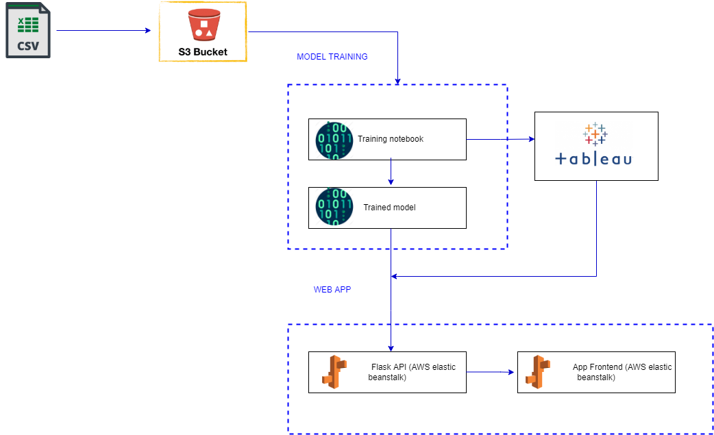

# Purpose and motivation

The purpose of this repo is to have an idea what is the current housing market in Perth, Western Australia. This repo demonstrates how linear regression (machine learning) is used to predict house price in Perth with an accuracy of 59%, and allows users to enter inputs and received a predicted house price in return.

The app is hosed on AWS using Elastic Beanstalk (ELB).

# Repo structure

```

images/                                                        # contains images used for the README
app/
    |__static
              |__js                                            # contains javascipt files
              |__py                                            # contains sav files (machine learning models)
    |__templates                                               # contains html files
    |__app.py                                                  # Flask application
    |__prediction.py
    |__build.bat
    |__Procfile
    |__requirements.txt
    |__web-app.zip
    
model/                                                        # contains machine learning notebook
Resources/                                                    # contains raw data in CSV format
tableau.csv                                                   # contains cleaned data in CSV format for visualization on Tableau

```

# Solution

## Soltion architecture

The solution architecture diagram was created using: https://draw.io/

Icons were taken from: https://www.flaticon/ and https://www.vecta.io/



# Machine Learning Model

## Multi-Linear Regression Model

X(Input): ["BUILD_YEAR","BEDROOMS","BATHROOMS","LAND_AREA","FLOOR_AREA","CBD_DIST","NEAREST_SCH_RANK"]
Y(Output): ["PRICE"]

# Usage

## Installing all required dependencies

pip freeze>requirements.txt

## Running code locally

To run the application locally, simply run 

```
cd app
python app.py
```

You should see the following which indicates that your app is running locally: 
```
* Serving Flask app 'app' (lazy loading)
* Environment: production
WARNING: This is a development server. Do not use it in a production deployment.
Use a production WSGI server instead.
* Debug mode: on
* Running on http://127.0.0.1:5000/ (Press CTRL+C to quit)
* Restarting with stat
* Debugger is active!

## Deploying Web Application to AWS Elastic Beanstalk

#### Build app

Before we can deploy the app, we need to first build the app. 

Building the app refers to packaging and compiling the app so that it is in a state that can be readily deployed onto the target platform (e.g. AWS, Heroku, Azure, GCP, etc). We can skip the compilation since Python is not a compiled language, however we still need to package the app. 

To package the app, we will run the following lines of code: 

<b>macOS</b>:
```
zip -r web-app.zip templates static
zip -g web-app.zip app.py prediction.py requirements.txt Procfile
```

<b>windows</b>:

Note for Windows-only - You will need to install 7z (7-zip) which is a command line tool used for zipping files. 

1. Go to https://www.7-zip.org/ and download the version for your windows PC (usually 64-bit x64)
2. Run the installer .exe file 
3. Add the path `C:\Program Files\7-Zip` to your environment variables `path` 

```
7z a -tzip web-app.zip templates static
7z a -tzip web-app.zip app.py prediction.py requirements.txt Procfile

This will produce a `.zip` file which contains all the code and library packages required to run the app on AWS Lambda.  

For re-use, we've stored the commands in build.sh and build.bat respectively. 

You can just build the app by running either 

<b>macOS</b>:
```
. ./build.sh
```

<b>windows</b>:
```
build.bat
```

#### Deploy app

1. In the AWS Console, search for "Elastic Beanstalk". 
2. Choose the region closest to you on the top-right e.g. Sydney (ap-southeast-2)
3. Select "Create Application" 
4. Configure ELB. Note: Unless specified, leave the settings to default. 
    1. Provide the application name 
    2. Select Platform: "Python"
    3. Select Platform Branch: "Python 3.8 running on 64bit Amazon Linux 2"
    4. In the "Application code" section, select "Upload your code"
        - Select "Local file" > "Choose file" and select the `.zip` file you have built 
    5. Select "Configure more options" 
        1. Select "Software" > "Edit"
            - Provide the environment properties based on your environment variables in config.template.sh or config.template.bat.
            - Select "Save" 
        2. Select "Capacity" > "Edit" 
            - Under "Instance types", ensure that only "t2.micro" is selected. 
            - Select "Save" 
    6. Select "Create app" 


